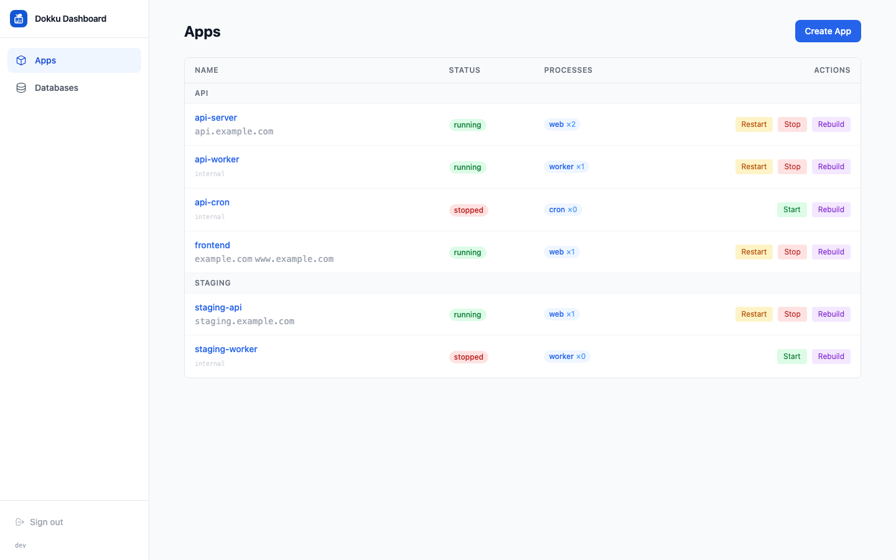

# Dokku Dashboard

Web dashboard for managing a [Dokku](https://dokku.com) server. Built with Hono + HTMX, connects via SSH.



## Features

- App management — start, stop, restart, destroy, create
- Log streaming (live SSE)
- Environment variables editor
- Domain management with Let's Encrypt
- Process scaling
- Postgres databases with optional SQL explorer
- Google OAuth (restrict to your org) or password auth

## App Types

The dashboard groups apps into **APIs**, **Bots**, and **Indexers**. Set the `DOKKU_APP_TYPE` env var on each app so it appears in the right section:

```bash
dokku config:set --no-restart my-app DOKKU_APP_TYPE=api     # default
dokku config:set --no-restart my-worker DOKKU_APP_TYPE=bot
dokku config:set --no-restart my-indexer DOKKU_APP_TYPE=indexer
```

Apps without this var default to **api**. If you deploy via GitHub Actions, set it in your workflow:

```yaml
- name: Create app and configure
  run: |
    dokku apps:create my-app || true
    dokku config:set --no-restart my-app DOKKU_APP_TYPE=bot
```

## Quick Start

```bash
# 1. Clone
git clone git@github.com:mutativ/dokku-dashboard.git
cd dokku-dashboard

# 2. Interactive setup (generates .env)
./bin/setup.sh

# 3. Deploy to your VPS
./bin/deploy.sh root@your-vps-ip --ssh-key ~/.ssh/your_key
```

That's it. The deploy script builds a Docker image, pushes it to your VPS, and deploys it as a Dokku app.

## Deploy

### Automatic (GitHub Actions)

Push to `main` → auto-deploy. Works out of the box for forks.

> **Monorepo deployment** — [stake-dao/backend-monorepo](https://github.com/stake-dao/backend-monorepo) tracks a fork of this repo ([stake-dao/dokku-dashboard](https://github.com/stake-dao/dokku-dashboard)). The fork auto-syncs from this repo every 6 hours and triggers a redeploy. See [`.github/workflows/sync-fork.yml`](./.github/workflows/sync-fork.yml).

1. Add 2 GitHub Secrets to your repo:
   | Secret | Value |
   |--------|-------|
   | `DOKKU_HOST` | VPS IP or hostname |
   | `DOKKU_SSH_PRIVATE_KEY` | SSH private key authorized on Dokku |

2. Optionally set `DOKKU_APP_NAME` as a GitHub Variable (defaults to `dokku-dashboard`).

3. Push to `main` — the workflow checks out the repo and `git push`es to Dokku, which builds the Dockerfile on the VPS and deploys with zero downtime.

### Manual (`bin/deploy.sh`)

For first-time setup or when changing env config:

```bash
# Full deploy — builds image, sets config, deploys
./bin/deploy.sh root@your-vps-ip --ssh-key ~/.ssh/your_key

# Code-only — skip config:set, just rebuild
./bin/deploy.sh --code-only
```

### Fork Setup

1. Fork the repo
2. On your VPS: `dokku apps:create dokku-dashboard`
3. Run `./bin/setup.sh` to generate `.env`, then `./bin/deploy.sh` once to create the app and set config
4. Add the 2 GitHub Secrets above
5. Push to `main` — auto-deploys from now on

## VPS Requirements

- A server running [Dokku](https://dokku.com/docs/getting-started/installation/)
- SSH access (root or a user with `docker` group)
- Docker installed on the VPS (Dokku installs this)

No other dependencies needed on the server — the dashboard runs as a Dokku app itself.

## Authentication

### Option 1: Google OAuth (recommended for teams)

Restrict access to your Google Workspace organization:

1. Go to [Google Cloud Console](https://console.cloud.google.com/) and create a project
2. Navigate to **APIs & Services > OAuth consent screen**, select **Internal** (org only)
3. Create **OAuth 2.0 credentials** (Web application type)
4. Add your dashboard URL as an authorized redirect URI: `https://your-domain.com/auth/google/callback`
5. Configure the dashboard:

```bash
dokku config:set dokku-dashboard \
  AUTH_MODE=google \
  GOOGLE_CLIENT_ID="your-client-id" \
  GOOGLE_CLIENT_SECRET="your-client-secret" \
  GOOGLE_ALLOWED_DOMAIN="yourorg.com" \
  PUBLIC_URL="https://your-domain.com"
```

Only users with a `@yourorg.com` Google account can sign in.

### Option 2: Password auth

Simple shared password — good for single-user setups:

```bash
# Generate a password hash
pnpm run hash-password
# or: npx tsx src/hash-password.ts

# Set it on the server
dokku config:set dokku-dashboard \
  AUTH_MODE=password \
  DASHBOARD_PASSWORD_HASH="scrypt:..."
```

### Option 3: Both

Set `AUTH_MODE=both` to show both Google and password login options.

## Setup

### 1. Generate a dedicated SSH key

The dashboard connects to Dokku via SSH. Create a key specifically for it:

```bash
# On your VPS
ssh-keygen -t ed25519 -f /root/.ssh/dokku_dashboard_key -N ""

# Register it with Dokku
cat /root/.ssh/dokku_dashboard_key.pub | dokku ssh-keys:add dashboard
```

> **Important:** Don't include `admin` in the key name — `dokku-acl` grants admin keys unrestricted access.

### 2. Run the setup script

```bash
./bin/setup.sh
```

It prompts for SSH host, port, user, key path, auth mode, and generates a `.env` file with a random `SESSION_SECRET`. Use `.env.example` as a reference for all available options.

### 3. Deploy

```bash
# Uses root@<DOKKU_SSH_HOST> from .env by default
./bin/deploy.sh

# Or specify explicitly
./bin/deploy.sh root@1.2.3.4 --ssh-key ~/.ssh/my_key

# Custom app name
./bin/deploy.sh root@1.2.3.4 --app my-dashboard
```

The deploy script:
1. Builds a `linux/amd64` Docker image locally
2. Pushes it via `docker save | ssh docker load`
3. Creates the Dokku app if needed
4. Sets all env vars from `.env`
5. Deploys with `git:from-image`

### 4. Custom domain + SSL

```bash
dokku domains:add dokku-dashboard your-domain.com
dokku letsencrypt:enable dokku-dashboard
```

## Security Hardening

### Restrict SSH commands with dokku-acl

Install [dokku-acl](https://github.com/dokku-community/dokku-acl) to limit what the dashboard's SSH key can do:

```bash
dokku plugin:install https://github.com/dokku-community/dokku-acl.git acl

dokku config:set --global DOKKU_ACL_USER_COMMANDS="apps:list,apps:create,apps:destroy,ps:report,ps:start,ps:stop,ps:restart,ps:rebuild,ps:scale,logs,config:get,config:show,config:set,config:unset,domains:report,domains:add,domains:remove,letsencrypt:enable,letsencrypt:disable,postgres:list,postgres:create,postgres:destroy,postgres:info,postgres:link,postgres:unlink,postgres:links,postgres:connect,resource:report,resource:limit"
```

This blocks dangerous commands (`docker-options:add`, `storage:mount`, `ssh-keys:add`, `plugin:install`, `network:*`) at the Dokku layer — even if the dashboard is compromised.

### Network isolation

Restrict who can reach the dashboard:

- **Tailscale** — Run on a mesh VPN. Only devices on your tailnet can access it.
- **IP allowlist** — Restrict via nginx:
  ```bash
  mkdir -p /home/dokku/dokku-dashboard/nginx.conf.d
  echo 'allow 1.2.3.4; deny all;' > /home/dokku/dokku-dashboard/nginx.conf.d/ip-restrict.conf
  dokku nginx:build-config dokku-dashboard
  ```
- **Cloudflare Access** — Identity-aware proxy at the edge.

### Trusted proxies

If behind a reverse proxy, set `TRUSTED_PROXIES` so rate limiting uses the real client IP:

```bash
dokku config:set dokku-dashboard TRUSTED_PROXIES="10.0.0.1,172.16.0.0/12"
```

## Local Development

```bash
pnpm install    # or: bun install
pnpm dev        # starts with hot reload on :4200
```

## Environment Variables

| Variable | Required | Default | Description |
|----------|----------|---------|-------------|
| `AUTH_MODE` | No | `password` | `password`, `google`, or `both` |
| `DASHBOARD_PASSWORD_HASH` | When password auth | | scrypt hash (`pnpm run hash-password`) |
| `SESSION_SECRET` | Yes | | 32+ char hex string for cookie signing |
| `GOOGLE_CLIENT_ID` | When google auth | | OAuth 2.0 client ID |
| `GOOGLE_CLIENT_SECRET` | When google auth | | OAuth 2.0 client secret |
| `GOOGLE_ALLOWED_DOMAIN` | When google auth | | Workspace domain (e.g. `yourorg.com`) |
| `PUBLIC_URL` | When google auth | | Dashboard URL (e.g. `https://dash.yourorg.com`) |
| `DOKKU_SSH_HOST` | Yes | | Dokku server IP/hostname |
| `DOKKU_SSH_PORT` | No | `22` | SSH port |
| `DOKKU_SSH_USER` | No | `dokku` | SSH username |
| `DOKKU_SSH_KEY` | Yes | | Base64-encoded SSH private key |
| `PORT` | No | `4200` | Dashboard port |
| `ENABLE_SQL_EXPLORER` | No | `false` | Enable the SQL query runner |
| `TRUSTED_PROXIES` | No | | Comma-separated IPs for X-Forwarded-For |

## Stack

- **[Hono](https://hono.dev)** — HTTP framework
- **[HTMX](https://htmx.org)** — Server-rendered interactivity
- **[ssh2](https://github.com/mscdex/ssh2)** — Native SSH client (no system openssh)
- **[Tailwind CSS](https://tailwindcss.com)** — Utility-first styling
- **TypeScript** — Compiled to JS, runs on Node.js 22

## License

MIT
